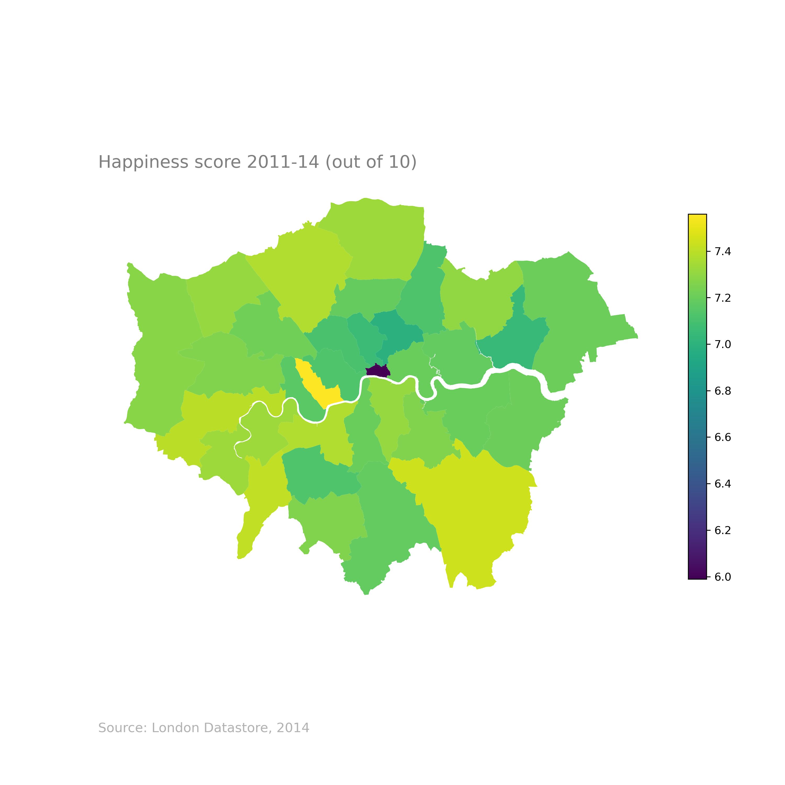

# data-viz-projects
Repository for python-based data visualization projects

## Tidal Swells around the UK and Ireland

[WebScraping Notebook](UKIrelandTidalSwings/UK-IE-TidalSwings_WebScrape.ipynb)

[Geocoding Notebook](UKIrelandTidalSwings/UK-IE-TidalSwings_GeoCoding.ipynb)

[Interpolation and Plotting Notebook](UKIrelandTidalSwings/UK-IE-TidalSwings_InterpolationAndPlotting.ipynb)

This project was inspired upon learning that the tidal swing of the Thames River in London is the result of a tidal swell from the north, coming around Scotland, down the North Sea, meeting the 'next' tidal swell from the south in the Thames estuary.

This project, while almost there, is unfinished. Python/matplotlib is perhaps not the correct tool for iterating these frame-wise gif animations. I am trying to produce a finished, interactive version of this visualisation through D3.js, and will update this file with a link when complete.

  

## UK COVID Cases Animation

[Notebook - Web Scraping](UKCovidCases/UK_COVID_Cases_Web_Scraping.ipynb)

[Notebook - Plotting](UKCovidCases/UK_COVID_Cases_Plotting.ipynb)

This animation tracks new cases of COVID-19 across the UK (with a zoomed in inset on London). This project used Selenium to scrape GOV.uk for their local authority-level COVID case data, as this data is only published in individual tables, not combined. GeoPandas was then used to plot frames for each day (after a 7-day rolling average was applied).

          

## UK House Price Analysis Animation

[Notebook](UKHousePriceAnimation/UKHousePriceAnimation.ipynb)

This animated viz. replicated [this interesting animation](https://github.com/jgleeson/housing_analysis/blob/master/House_price_cycle.md), originally done in R, as practice in pandas data manipulation, and matplotlib figure customization/animation. 

The resulting figure (shown right) plots percentage change (average over three years) in average house price in English local areas against the ranked average house price at the beginning of the three year period. It demonstrates a 'ripple' effect, where expensive areas (high rank) see an increase in house price, with less expensive areas following in a later years in a 'wave' manner. 

Huge thanks to the original author for such a great project.

   

## London Borough Choropleths

[Notebook](LondonBoroughChoropleths/London_borough_choropleths.ipynb)

An exploration of GeoPandas, using GIS shape data to look at the difference between London boroughs for a variety of metrics/statistics.

Many thanks to @bendoesdataviz for this [great walkthrough](https://towardsdatascience.com/lets-make-a-map-using-geopandas-pandas-and-matplotlib-to-make-a-chloropleth-map-dddc31c1983d).
